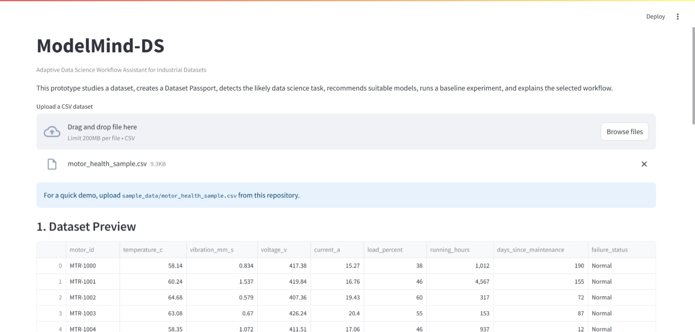
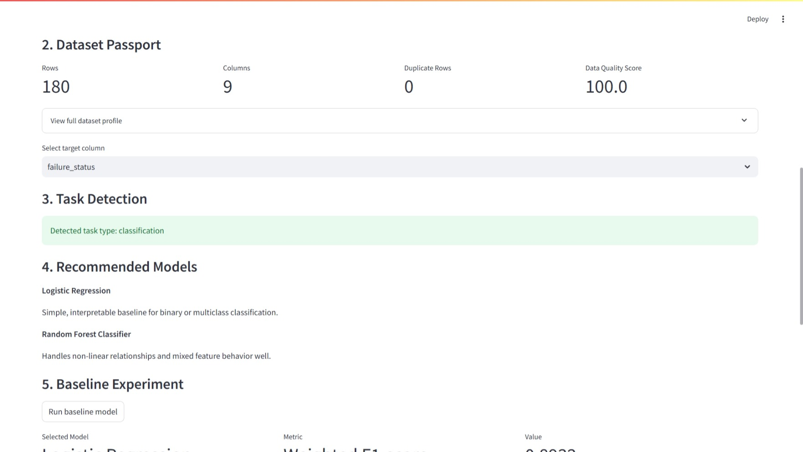
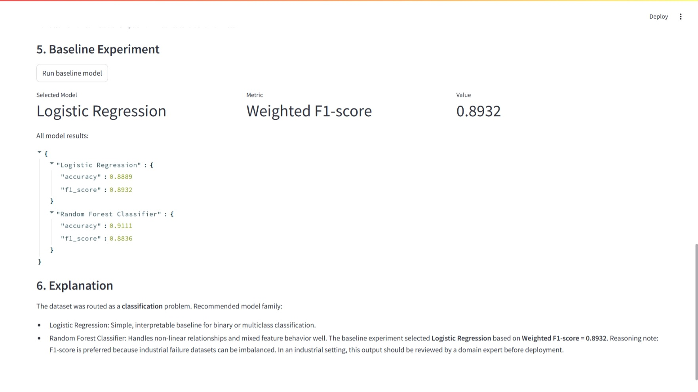

# ModelMind-DS

**Adaptive data science workflow assistant for industrial datasets.**

ModelMind-DS is a lightweight Streamlit prototype that turns a raw CSV dataset into a first-pass machine learning workflow. It profiles the dataset, builds a dataset passport, infers the likely data science task, recommends suitable baseline models, runs an initial experiment, and generates a plain-language explanation for review.

> Built as a student prototype for ABB EngineeredX 2.0. ModelMind-DS is intended for decision support and workflow exploration, not autonomous industrial deployment.

---

## Table of Contents

- [Overview](#overview)
- [Why ModelMind-DS](#why-modelmind-ds)
- [Key Features](#key-features)
- [Demo Workflow](#demo-workflow)
- [Supported Task Types](#supported-task-types)
- [Architecture](#architecture)
- [Repository Structure](#repository-structure)
- [Getting Started](#getting-started)
- [Run the Streamlit App](#run-the-streamlit-app)
- [Run the CLI Demo](#run-the-cli-demo)
- [Example Use Case](#example-use-case)
- [Core Modules](#core-modules)
- [Limitations](#limitations)
- [Roadmap](#roadmap)
- [License](#license)

---

## Overview

Industrial analytics teams often receive datasets with different structures, target variables, quality issues, and modeling goals. ModelMind-DS provides a guided first step for these scenarios by combining:

- **Dataset profiling** to summarize schema, missing values, duplicates, and column types.
- **Task routing** to classify the problem as classification, regression, clustering, or time-series/regression.
- **Model recommendation** to suggest practical baseline model families.
- **Baseline execution** to train and compare simple models using task-appropriate metrics.
- **Explainability** to document why a workflow and model were selected.

The goal is to help users move from an uploaded CSV to a structured modeling recommendation quickly, while keeping a human expert in the review loop.

---

## Why ModelMind-DS

Industrial datasets can represent very different problems:

- Predictive maintenance and motor health monitoring
- Energy usage and load forecasting
- Quality inspection and defect detection
- Process optimization
- Sensor anomaly detection
- Equipment failure classification

A single fixed model is rarely appropriate across all of these situations. ModelMind-DS behaves like an adaptive controller: it studies the dataset first, then routes the workflow to a suitable modeling strategy.

---

## Key Features

- Upload and inspect CSV datasets through a Streamlit interface.
- Generate a **Dataset Passport** with rows, columns, missing values, duplicates, numeric columns, categorical columns, and datetime candidates.
- Compute a simple data quality score from missing-value and duplicate-row signals.
- Detect task type from selected target-column behavior.
- Recommend baseline models for classification, regression, clustering, and time-series/regression candidates.
- Run baseline experiments with scikit-learn models.
- Compare model performance with relevant metrics:
  - Weighted F1-score for classification
  - Mean Absolute Error for regression
  - Cluster count for clustering
- Generate a plain-language workflow explanation for reporting and expert review.
- Include a sample industrial motor-health dataset for quick demonstration.

---

## Demo Workflow

1. Launch the Streamlit app.
2. Upload the sample motor-health CSV dataset.
3. Review the generated Dataset Passport.
4. Select `failure_status` as the target column.
5. Confirm the detected task type.
6. Review recommended models.
7. Run the baseline model experiment.
8. Read the generated explanation and metrics summary.

---

## Supported Task Types

| Task Type | Detection Signal | Baseline / Suggested Models | Primary Metric |
| --- | --- | --- | --- |
| Classification | Categorical target or low-cardinality numeric target | Logistic Regression, Random Forest Classifier | Weighted F1-score |
| Regression | Numeric target with many unique values | Linear Regression, Random Forest Regressor | Mean Absolute Error |
| Clustering | No target column selected | K-Means | Cluster count |
| Time-series/regression | Datetime-like column plus numeric target | Random Forest Regressor; ARIMA/Prophet as future extension | Mean Absolute Error |
| Unknown/manual review | Unsupported or ambiguous dataset structure | Manual review required | N/A |

---

## Architecture

```text
Dataset Input
    ↓
Dataset Passport
    ↓
Task Router
    ↓
Model Recommender
    ↓
Baseline Runner
    ↓
Metrics + Explanation
    ↓
Industrial Expert Review
```

### Pipeline Responsibilities

1. **Dataset Input** — accepts a user-uploaded CSV file.
2. **Dataset Passport** — summarizes dataset shape, column types, missingness, duplicates, and datetime candidates.
3. **Task Router** — infers the likely machine learning task from the selected target column and dataset structure.
4. **Model Recommender** — maps the detected task to sensible baseline model families.
5. **Baseline Runner** — trains baseline models and compares task-specific metrics.
6. **Explanation Layer** — produces a human-readable explanation of the selected workflow.
7. **Industrial Review** — treats outputs as decision-support artifacts that require domain validation before production use.

---

## Repository Structure

```text
modelmind-ds/
├── README.md
├── LICENSE
└── modelmind-ds-complete-github-submission/
    └── modelmind-ds-github-submission/
        ├── README.md
        ├── app.py
        ├── demo_cli.py
        ├── requirements.txt
        ├── assets/
        │   └── architecture.txt
        ├── core/
        │   ├── __init__.py
        │   ├── explanation.py
        │   ├── model_recommender.py
        │   ├── model_runner.py
        │   ├── profiler.py
        │   └── task_router.py
        ├── reports/
        │   └── sample_output.md
        └── sample_data/
            └── motor_health_sample.csv
```

The runnable project files are located in:

```text
modelmind-ds-complete-github-submission/modelmind-ds-github-submission/
```

---

## Getting Started

### Prerequisites

- Python 3.10 or newer recommended
- `pip`
- A terminal or command prompt

### Clone the Repository

```bash
git clone https://github.com/your-username/modelmind-ds.git
cd modelmind-ds/modelmind-ds-complete-github-submission/modelmind-ds-github-submission
```

### Create and Activate a Virtual Environment

macOS/Linux:

```bash
python -m venv .venv
source .venv/bin/activate
```

Windows PowerShell:

```powershell
python -m venv .venv
.venv\Scripts\Activate.ps1
```

### Install Dependencies

```bash
pip install -r requirements.txt
```

---

## Run the Streamlit App

From the runnable project directory:

```bash
streamlit run app.py
```

Then open the local Streamlit URL shown in your terminal and upload:

```text
sample_data/motor_health_sample.csv
```

For the recommended demo, select:

```text
failure_status
```

as the target column.

---

## Demo Screenshot

The Streamlit prototype demonstrating dataset upload, task detection, model recommendation, and explainable reporting.



.

---

## Run the CLI Demo

A command-line demo is also included for quick validation:

```bash
python demo_cli.py
```

The CLI demo loads the included motor-health sample dataset, routes the task, runs the baseline experiment, and prints the generated explanation.

---

## Example Use Case

The included sample dataset represents industrial motor-health monitoring. It contains columns such as:

- Motor identifier
- Temperature
- Vibration
- Voltage
- Current
- Load percentage
- Running hours
- Days since maintenance
- Failure status

When `failure_status` is selected as the target, ModelMind-DS detects a classification problem. It recommends classification baselines such as Logistic Regression and Random Forest Classifier, runs an experiment, compares weighted F1-scores, and explains why the selected model is appropriate for the dataset.

---

## Core Modules

| Module | Purpose |
| --- | --- |
| `core/profiler.py` | Creates the Dataset Passport and computes the data quality score. |
| `core/task_router.py` | Detects the likely ML task from target-column and datetime signals. |
| `core/model_recommender.py` | Returns recommended baseline models for each task type. |
| `core/model_runner.py` | Prepares features, trains baseline models, and returns metrics. |
| `core/explanation.py` | Builds a plain-language explanation of recommendations and results. |
| `app.py` | Provides the Streamlit user interface. |
| `demo_cli.py` | Runs the sample workflow from the command line. |

---

## Limitations

ModelMind-DS is a prototype and should not be treated as a production-grade AutoML system. Current limitations include:

- Limited preprocessing and feature engineering.
- No hyperparameter optimization.
- No persistent experiment tracking.
- Time-series support is detected but not fully implemented as a forecasting workflow.
- Anomaly detection is planned but not yet implemented in the baseline runner.
- No SHAP, counterfactual, or feature-importance explanation layer yet.
- No production monitoring, drift detection, or deployment safety controls.

All outputs should be reviewed by a qualified data scientist or domain expert before real-world use.

---

## Roadmap

Planned enhancements include:

- Add dedicated time-series forecasting workflows.
- Add anomaly detection with Isolation Forest or similar methods.
- Add model cards and richer report generation.
- Add SHAP-based explainability.
- Add LLM-assisted natural-language report summaries.
- Add MLflow experiment tracking.
- Add model and data drift monitoring hooks.
- Add automated tests for the core modules.
- Package the project with a cleaner top-level application layout.

---

## License

This repository is distributed under the license included in MIT LICENSE 2.0

---

## Author

Prepared as a student prototype for ABB EngineeredX 2.0.
